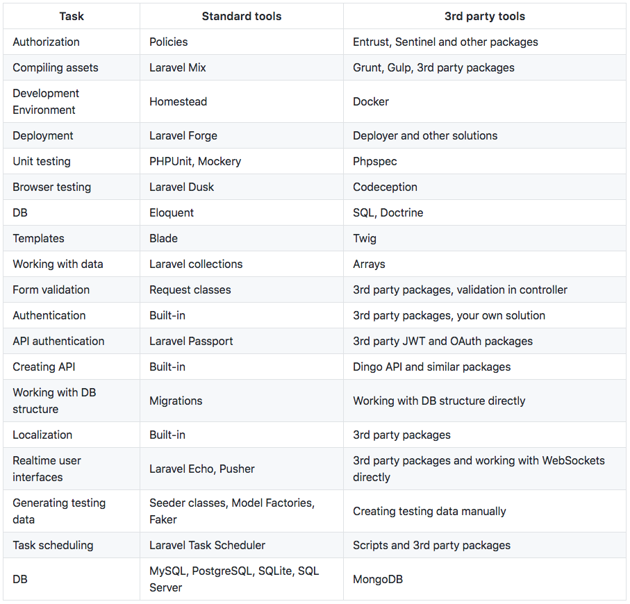
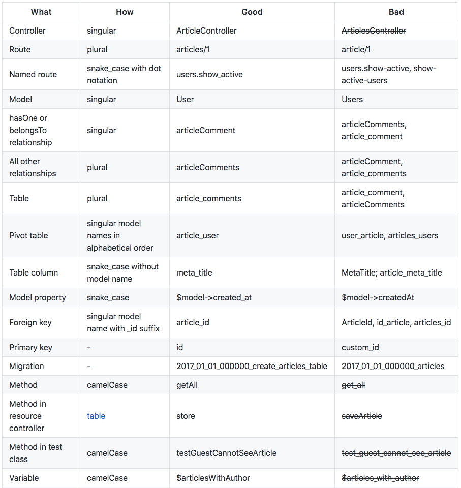
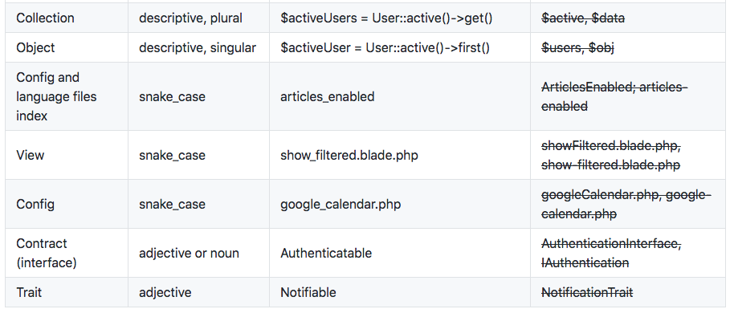

# Laravel Review Guide

[[toc]]

## Coding Style

Laravel follows the PSR-2 coding standard and the PSR-4 autoloading standard.

## Design Patterns

It is easy to mess up your Laravel application if you don’t have any sort of pattern to follow. The following design patterns are recommended for those who are building an application with Laravel or want to refactor their existing projects:
  * Domain Driven Design
  * Don’t call Eloquent models directly, Use Repositories (if the project architecture is set up that way)
  * Inversion Of Control Container and Dependency Injection
  * SOLID Principle

## Single responsibility principle

A class and a method should have only one responsibility.

## Fat models, skinny controllers

Put all DB related logic into services or into model/repository classes if you're using Query Builder or raw SQL queries.

## Validation

Move validation from controllers to Request or Validator classes.

## Business logic should be in service class

A controller must have only one responsibility, so move business logic from controllers to service classes.

## Don't repeat yourself (DRY)

Reuse code when you can. SRP is helping you to avoid duplication. Also, reuse Blade templates, use Eloquent scopes etc.

## Do not execute queries in Blade templates and use eager loading

(N + 1 problem)

## Use standard Laravel tools accepted by community

Prefer to use built-in Laravel functionality and community packages instead of using 3rd party packages and tools. Any developer who will work with your app in the future will need to learn new tools. Also, chances to get help from the Laravel community are significantly lower when you're using a 3rd party package or tool. Do not make your client pay for that.

## Follow Laravel naming conventions

## Prefer to use Eloquent over using Query Builder and raw SQL queries. Prefer collections over arrays

Eloquent allows you to write readable and maintainable code. Also, Eloquent has great built-in tools like soft deletes, events, scopes etc.

## Do not get data from the .env file directly

Pass the data to config files instead and then use the config() helper function to use the data in an application.

## Store dates in the standard format.

Use accessors and mutators to modify date format

## Working with UTF-8

Laravel uses the **patchwork/utf8** for most of its UT8-related stuff. It is required that all developers understands the following concepts:

  * [Character Sets / Character Encoding Issues](http://www.phpwact.org/php/i18n/charsets)
  * [Handling UTF-8 with PHP](http://www.phpwact.org/php/i18n/utf-8)
  * [Unicode Normalization](http://en.wikipedia.org/wiki/Unicode_equivalence)
  * [Grapheme Clusters](http://unicode.org/reports/tr29/)
  * [Unicode Security Considerations](http://www.unicode.org/reports/tr36/#Deletion_of_Noncharacters)

## Table and field naming

Table and field names MUST be lowercase and use snake_case.

Table names should use the plural form of the actual real life object it is storing. Like for example, the table name for blog posts should be posts not post.

Primary keys should be named “id” in the table names. While the foreign key it represents in other table should be on singularform_id. (e.g. table: post, primary key: id, foreign key: post_id )

## Changing tables, index or inserting sample data.

DON’T create tables or index directly via PHPMyAdmin or console. Use database migration to create table, add/alter any fields, and commit those to Git repository.

DON’T directly pass the database export (sql files) to your colleagues in order to share your database changes. Let them run the migration files you committed to the repository.

DON’T insert fake values directly into the database for testing purposes. Create Seeder files to populate your database.

## Date and Time

Although PHP has a class named DateTime to help you when reading, writing, comparing or calculating with date and time. It is recommended that you use the Carbon library for dealing with dates.